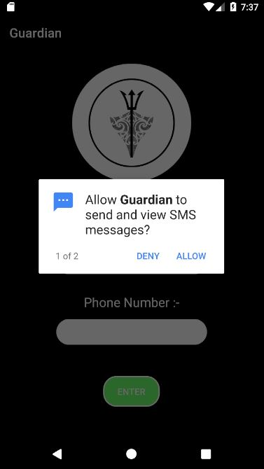
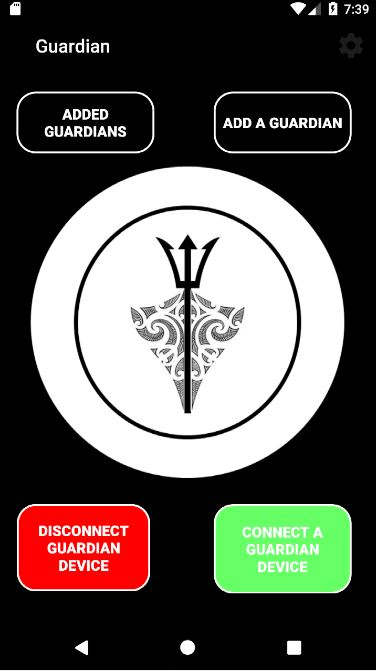
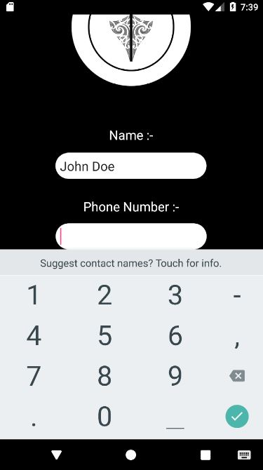
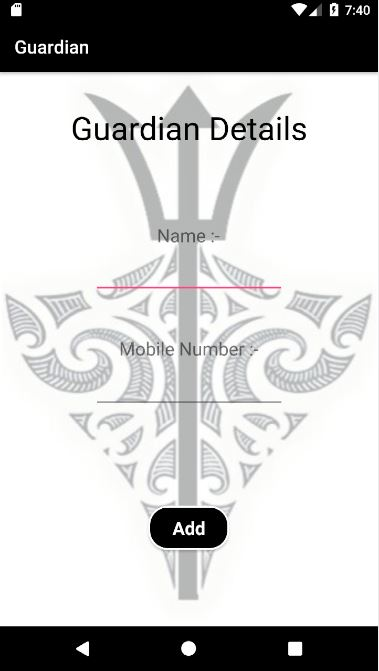
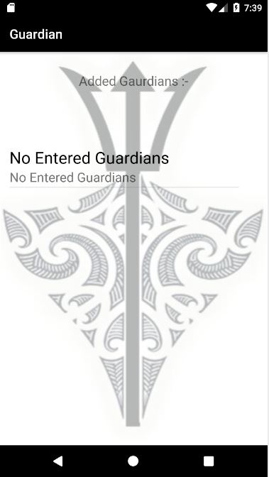

# Guardian
Wearable devices have gained a lot of credit in the past few years. Their applications are unlimited. They cover domains such as healthcare, fitness tracking, navigation systems, etc. One very important, and rather unexplored domain of wearable devices is self-defense and security. This paper describes a self-defense mechanism based on a combination of concepts such as wearable technology and the Internet of Things. The framework aims to protect the user in cases of emergency by sending out an SOS to the loved ones. Security applications of wearable devices can help save lives in situations of distress and danger by providing a prompt and fast notification mechanism to the users.

## Features
1) Add and remove guardians
2) Location tracking
3) Services
4) Alert message via SMS service
5) Bluetooth connection to Guardian device
6) Animated home page

## Screenshots
1) Start Up

2) Main Menu

3) Add User details

4) Add Guradians

5) Guardians

